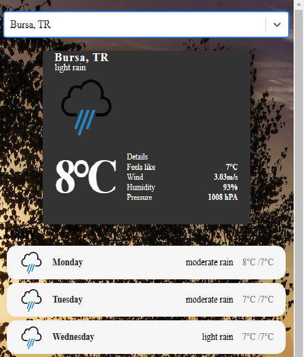

# Hava Durumu Uygulaması / Weather App

Bu projede rapidapi sitesinden fetch ile çektiğim geo-db apisinden search bar ile girilen inputa göre filtereleme yapıp şehir isimlerini buldum.  Şehirlerin anlık hava durumu ve 8günlük tahmini ise openweathermap sitesinden fetch methodu ile çektim.Filterelenen şehir ismine göre weather-api dan ilgili şehrin datasını map fonksiyonu ile sayfada gösterdim.

 
 

## API
Geo-API https://wft-geo-db.p.rapidapi.com/v1/geo
Weather-API https://api.openweathermap.org/data/2.5

## demo
https://weather-projecapp.netlify.app/
